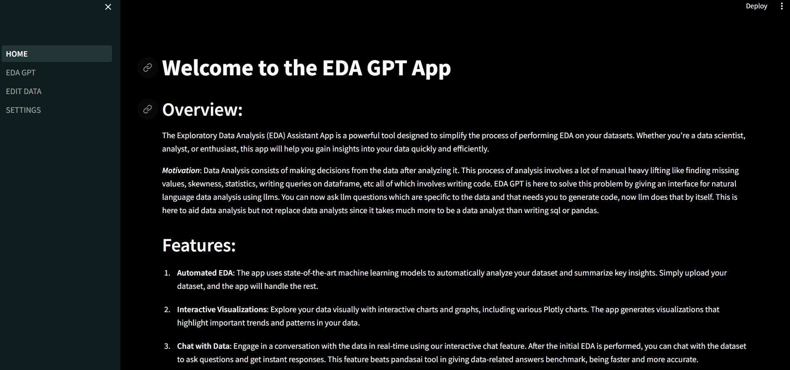
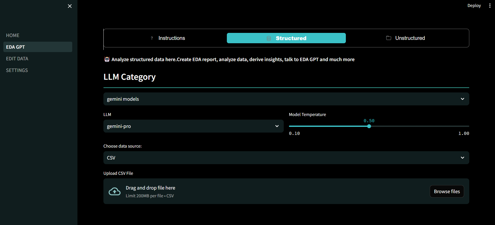
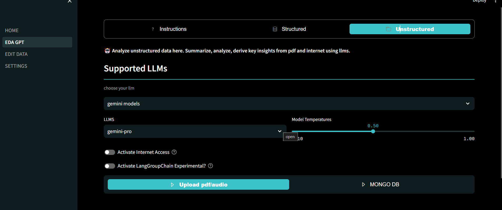
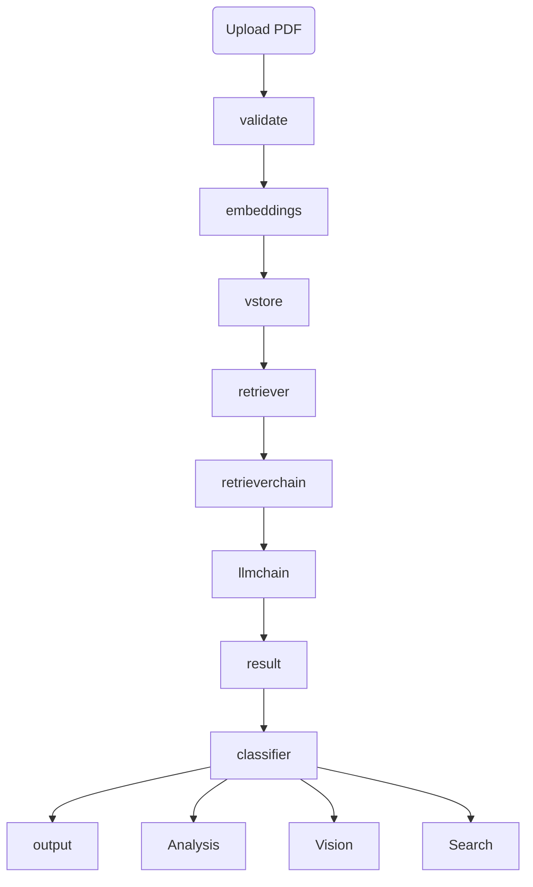

# EDA GPT: Your Open-Source Data Analysis Companion

  
  


##  Project Overview

**EDA GPT** is a cutting-edge, open-source tool designed to streamline the data analysis process using natural language interfaces and powerful AI models. Whether you're working with structured datasets like CSVs and SQL databases or unstructured sources such as PDFs and images, EDA GPT empowers users to conduct Exploratory Data Analysis (EDA) and derive meaningful insights effortlessly.

##  Key Highlights

-  **Structured & Unstructured Data Support**  
-  **Interactive Visualizations with Plotly & Pygwalker**  
-  **Multimodal & Internet-Enabled Search**  
-  **Smart Data Cleaning with AutoClean & ML Models**  
-  **LLM Support: OpenAI, Claude3, Gemini, Groq, LLaMA, Ollama (Offline)**  
-  **Unique Lang Group Chain Architecture for Complex Multi-Step Queries**

---

## Getting Started

Simply run the app and follow the intuitive UI to upload your data. You can:

- Upload structured files (`CSV`, `XLSX`, `SQLite`) or connect to a database.
- Analyze unstructured content like PDFs or images.
- Ask questions in natural language.
- Get generated Python code, charts, and summaries on the fly.

---

## How to Use the App

### 1. Structured Data Analysis
- Upload files or connect to databases.
- Specify context and objectives for enhanced analysis accuracy.

### 2. Graph Generation
- Generate visuals using natural language.
- Customize generated code snippets.

### 3. Ask Questions
- Post queries after EDA to extract insights.
- Get dynamic visual answers.

### 4. Performance Comparison

```mermaid
xychart-beta
 title "Comparison of EDA GPT (blue) and PandasAI (green) Performance"
 x-axis ["Accuracy", "Speed", "Complex Queries"]
 y-axis "Score (out of 100)" 0 --> 100
 bar EDA_GPT [90, 92, 90]
 bar PandasAI [85, 90, 70]
````

### 5. LLM Selection

* Choose from HuggingFace, OpenAI, Groq, Gemini, Claude3, GPT-4.
* Offline-friendly with Ollama.

### 6. Unstructured Data Analysis

* Extract tables, text, and visuals from PDFs and images.
* Smart vision models and multi-hop reasoning enabled.

### 7. Multimodal Search

* Search across Wikipedia, Arxiv, DuckDuckGo, and more.
* Handle queries combining text, images, and links.

### 8. Data Cleaning and Editing

* Clean using rule-based and model-based approaches.
* Classify data without calling LLMs, where applicable.

---

## Advanced Features

1. **Lang Group Chain Architecture**

   * Breaks complex questions into LangNodes.
   * Solves using a human-like reasoning chain (e.g. M = age diff + Pluto year).

2. **Advanced RAG + MultiQuery**

   * Embeds tables with context for higher retrieval accuracy.

3. **Offline & Privacy-Aware**

   * Use Ollama models for local processing.

4. **Classification Model Integration**

   * For quick inference and reduced LLM costs.

5. **AutoClean**

   * Automatically suggests and applies data cleaning operations.

---

## System Architecture

### Structured Data EDA

```mermaid
graph TB
   DATA(Upload Structured Data) --> analyze(Analyze) --> EDA(EDA Report)
   EDA --> docs(Doc Store) --> preprocessing --> embeddings --> vstore
   vstore --> retriever --> retrieverchain --> llmchain --> result(Answer)
   result --> Classifier --> display(Output)
```

### Unstructured Data EDA



---

## Why FAISS?

FAISS is optimal for mid-sized datasets (up to \~2GB), thanks to its inverted file indexing. For large documents like 100+ page PDFs, we use **Chroma** with HNSW indexing for efficient similarity search.

---

## Performance Optimizations

* Parallel document embedding & storage.
* Multiquery + Ensemble retrieval for high recall.
* Internet and doc search blended for enhanced answers.

---

## ⚠Recommendations & Notes

> For best results, **provide context-rich data** manually.
> Recommended models: **Claude3**, **Gemini**, **GPT-4**, **LLaMA 3**.

---

## Contributors

* **Tarun A** – AI & Data Science Engineering
* **Velprakash S** – AI & Data Science Engineering
* **Sriram R** – AI & Data Science Engineering

Feel free to fork, contribute, or star this project to show your support!

---

## License

This project is open-source and available under the [MIT License](LICENSE).
